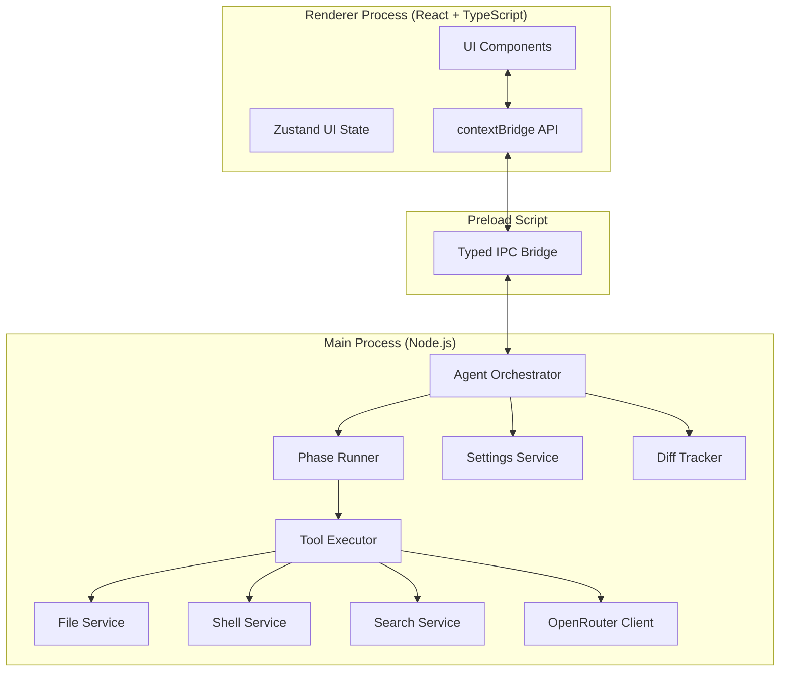

# Design Document: SlowBurn Agent

## Overview

SlowBurn is an Electron desktop application built with TypeScript and React. It orchestrates a deliberate, multi-phase AI coding agent that uses OpenRouter's chat completions API with tool calling to read files, write files, run shell commands, and search the web. The agent intentionally works through eight sequential phases — Research, Planning, Implementation, Bug Detection, Code Review, Re-Coding, Optimization, and Final Validation — before presenting a unified diff for user approval.

The design follows Electron's recommended security model: the renderer process handles all UI, the main process handles all privileged operations (filesystem, shell, IPC), and a preload script exposes a narrow, typed API bridge between them. All LLM calls are made from the main process to avoid exposing the API key to the renderer.

**Key technology choices:**
- **Electron 30+** with `contextIsolation: true` and `nodeIntegration: false`
- **React 18** + **TypeScript** for the renderer UI
- **Vite** as the bundler (via `electron-vite`)
- **electron-store** for persisted settings (non-sensitive)
- **Electron `safeStorage`** for encrypting the API key at rest
- **`react-diff-viewer-continued`** for the unified diff UI
- **`node-pty`** for streaming shell command output
- **OpenRouter `/api/v1/chat/completions`** with tool calling for agent inference
- **OpenRouter `/api/v1/models`** for model enumeration
- **SerpAPI or Brave Search API** as the configurable web search provider

---

## Architecture

The application is divided into three layers following Electron's process model:



### Process Responsibilities

**Main Process** — privileged Node.js environment:
- Manages all filesystem operations via `FileService`
- Executes shell commands via `ShellService` using `node-pty`
- Makes all HTTP requests (OpenRouter API, search API) via `OpenRouterClient` and `SearchService`
- Orchestrates agent phases via `AgentOrchestrator` and `PhaseRunner`
- Tracks file mutations during a task via `DiffTracker`
- Persists settings via `SettingsService` (electron-store + safeStorage)
- Enforces path sandboxing — all file/shell operations are validated against the project folder

**Preload Script** — narrow bridge:
- Exposes a typed `window.slowburn` API to the renderer using `contextBridge`
- Channels: `task:start`, `task:cancel`, `settings:get`, `settings:set`, `models:list`, `log:onEntry`, `phase:onChange`, `diff:onReady`

**Renderer Process** — React UI:
- Renders all UI components
- Subscribes to IPC events for log entries, phase changes, and diff readiness
- Sends user actions (start task, cancel, apply diff, discard diff) to main via IPC
- Holds no secrets — API key is never sent to the renderer

---

## Components and Interfaces

### IPC Channel Definitions

```typescript
// Renderer → Main (invoke)
interface SlowBurnAPI {
  startTask(params: StartTaskParams): Promise<void>;
  cancelTask(): Promise<void>;
  applyDiff(): Promise<ApplyResult>;
  discardDiff(): Promise<void>;
  getSettings(): Promise<AppSettings>;
  saveSettings(settings: Partial<AppSettings>): Promise<void>;
  listModels(): Promise<OpenRouterModel[]>;
  selectFolder(): Promise<string | null>;
}

// Main → Renderer (on)
interface SlowBurnEvents {
  'log:entry': (entry: LogEntry) => void;
  'phase:change': (update: PhaseUpdate) => void;
  'task:complete': (result: TaskResult) => void;
  'task:error': (error: TaskError) => void;
  'diff:ready': (diff: FileDiff[]) => void;
}
```

### Core Data Models

```typescript
interface StartTaskParams {
  description: string;
  modelId: string;
  projectFolder: string;
}

interface AppSettings {
  projectFolder: string;
  selectedModelId: string;
  searchProviderKey: string;
  // apiKey is never returned to renderer — managed in main only
}

interface OpenRouterModel {
  id: string;
  name: string;
  contextLength: number;
  pricing: { prompt: string; completion: string };
}

type AgentPhase =
  | 'research'
  | 'planning'
  | 'implementation'
  | 'bug_detection'
  | 'code_review'
  | 're_coding'
  | 'optimization'
  | 'final_validation';

interface PhaseUpdate {
  phase: AgentPhase;
  phaseIndex: number;   // 1-based, out of 8
  totalPhases: 8;
  status: 'active' | 'complete' | 'failed';
}

type LogEntryType = 'phase_header' | 'tool_call' | 'tool_result' | 'reasoning' | 'error' | 'cancelled';

interface LogEntry {
  id: string;
  timestamp: number;
  type: LogEntryType;
  phase: AgentPhase;
  content: string;
  metadata?: Record<string, unknown>;
}

interface FileDiff {
  relativePath: string;
  originalContent: string;
  modifiedContent: string;
  status: 'created' | 'modified' | 'deleted';
}

interface TaskResult {
  success: boolean;
  diffs: FileDiff[];
}

interface ApplyResult {
  success: boolean;
  failedFiles: string[];
}
```

### Agent Tool Definitions (OpenRouter Tool Calling)

The agent is given four tools via the OpenRouter `tools` parameter:

```typescript
const AGENT_TOOLS = [
  {
    type: 'function',
    function: {
      name: 'read_file',
      description: 'Read the contents of a file in the project folder',
      parameters: {
        type: 'object',
        properties: {
          path: { type: 'string', description: 'Relative path from project root' }
        },
        required: ['path']
      }
    }
  },
  {
    type: 'function',
    function: {
      name: 'write_file',
      description: 'Write or overwrite a file in the project folder',
      parameters: {
        type: 'object',
        properties: {
          path: { type: 'string', description: 'Relative path from project root' },
          content: { type: 'string', description: 'Full file content to write' }
        },
        required: ['path', 'content']
      }
    }
  },
  {
    type: 'function',
    function: {
      name: 'run_command',
      description: 'Execute a shell command in the project folder',
      parameters: {
        type: 'object',
        properties: {
          command: { type: 'string', description: 'Shell command to execute' }
        },
        required: ['command']
      }
    }
  },
  {
    type: 'function',
    function: {
      name: 'web_search',
      description: 'Search the web for information relevant to the task',
      parameters: {
        type: 'object',
        properties: {
          query: { type: 'string', description: 'Search query string' }
        },
        required: ['query']
      }
    }
  },
  {
    type: 'function',
    function: {
      name: 'list_directory',
      description: 'List files and folders in a directory within the project folder',
      parameters: {
        type: 'object',
        properties: {
          path: { type: 'string', description: 'Relative path from project root, use "." for root' }
        },
        required: ['path']
      }
    }
  }
];
```

### AgentOrchestrator

The central coordinator in the main process. Manages the task lifecycle:

```typescript
class AgentOrchestrator {
  private cancellationToken: CancellationToken;
  private diffTracker: DiffTracker;
  private messageHistory: ChatMessage[];

  async runTask(params: StartTaskParams): Promise<void>;
  async cancel(): Promise<void>;
  private async runPhase(phase: AgentPhase, systemPrompt: string): Promise<void>;
  private async executeToolCall(call: ToolCall): Promise<string>;
  private emitLog(entry: Omit<LogEntry, 'id' | 'timestamp'>): void;
  private emitPhaseChange(update: PhaseUpdate): void;
}
```

### PhaseRunner

Encapsulates the system prompt and loop logic for each phase. Each phase runs an agentic loop: call the LLM, execute any tool calls, feed results back, repeat until the LLM returns a message with no tool calls.

```typescript
class PhaseRunner {
  async run(
    phase: AgentPhase,
    taskDescription: string,
    messageHistory: ChatMessage[],
    tools: ToolDefinition[],
    openRouterClient: OpenRouterClient,
    toolExecutor: ToolExecutor,
    cancellationToken: CancellationToken,
    onLog: (entry: LogEntry) => void
  ): Promise<ChatMessage[]>; // returns updated message history
}
```

### DiffTracker

Tracks all file mutations during a task by storing original content before first write:

```typescript
class DiffTracker {
  private snapshots: Map<string, string | null>; // path → original content (null = new file)

  async snapshotBeforeWrite(absolutePath: string): Promise<void>;
  async computeDiffs(projectFolder: string): Promise<FileDiff[]>;
  async applyAll(): Promise<ApplyResult>;
  async discardAll(): Promise<void>;
  reset(): void;
}
```

### FileService

```typescript
class FileService {
  constructor(private projectFolder: string) {}

  validatePath(relativePath: string): string; // throws if outside project folder
  async readFile(relativePath: string): Promise<string>;
  async writeFile(relativePath: string, content: string): Promise<void>;
  async listDirectory(relativePath: string): Promise<DirectoryEntry[]>;
}
```

### ShellService

```typescript
class ShellService {
  constructor(
    private projectFolder: string,
    private timeoutMs: number = 120_000
  ) {}

  async execute(
    command: string,
    onOutput: (line: string) => void
  ): Promise<ShellResult>;
}

interface ShellResult {
  exitCode: number;
  stdout: string;
  stderr: string;
  timedOut: boolean;
}
```

### OpenRouterClient

```typescript
class OpenRouterClient {
  constructor(private apiKey: string, private modelId: string) {}

  async chatCompletion(
    messages: ChatMessage[],
    tools?: ToolDefinition[],
    signal?: AbortSignal
  ): Promise<ChatCompletionResponse>;

  async listModels(): Promise<OpenRouterModel[]>;
}
```

### SettingsService

```typescript
class SettingsService {
  getApiKey(): string | null;
  setApiKey(key: string): void;
  getSettings(): AppSettings;
  saveSettings(partial: Partial<AppSettings>): void;
  reset(): void;
}
```

Uses `electron-store` for non-sensitive settings and `safeStorage.encryptString` / `safeStorage.decryptString` for the API key, stored as an encrypted buffer in the electron-store file.

---

## Data Models

### Persistent Storage Schema

```typescript
// electron-store schema (non-sensitive)
interface PersistedStore {
  projectFolder: string;
  selectedModelId: string;
  searchProviderKey: string;       // search API key (lower sensitivity)
  encryptedApiKey: string;         // base64-encoded safeStorage-encrypted buffer
  windowBounds: { width: number; height: number; x: number; y: number };
}
```

### Agent Message History

The agent maintains a running `ChatMessage[]` array across all phases. Each phase appends its messages to the shared history, giving later phases full context of earlier work. The system prompt is prepended at the start of each LLM call and is phase-specific.

```typescript
interface ChatMessage {
  role: 'system' | 'user' | 'assistant' | 'tool';
  content: string | null;
  tool_calls?: ToolCall[];
  tool_call_id?: string;
  name?: string;
}
```

### Phase System Prompts

Each phase receives a tailored system prompt that instructs the LLM on its specific goal:

| Phase | System Prompt Focus |
|---|---|
| Research | Use `web_search` and `list_directory`/`read_file` to understand the codebase and problem domain. Minimum 2 web searches required. |
| Planning | Produce a numbered implementation plan. No tool calls expected. |
| Implementation | Execute the plan by writing files using `write_file`. |
| Bug Detection | Read written files, run tests/linters via `run_command`, identify defects. |
| Code Review | Evaluate code quality, patterns, edge cases. Produce a review report. |
| Re-Coding | Rewrite or refactor files based on Bug Detection and Code Review findings. |
| Optimization | Improve performance and code quality. |
| Final Validation | Run all tests and checks via `run_command`. Confirm everything passes. |

### Cancellation Model

A `CancellationToken` is created per task. The `PhaseRunner` checks the token between each LLM call and between each tool call execution. When cancelled, the runner throws a `CancellationError` which the orchestrator catches to trigger cleanup.

```typescript
class CancellationToken {
  private _cancelled = false;
  cancel(): void { this._cancelled = true; }
  get isCancelled(): boolean { return this._cancelled; }
  throwIfCancelled(): void {
    if (this._cancelled) throw new CancellationError();
  }
}
```

---

## Correctness Properties

*A property is a characteristic or behavior that should hold true across all valid executions of a system — essentially, a formal statement about what the system should do. Properties serve as the bridge between human-readable specifications and machine-verifiable correctness guarantees.*

### Property 1: File path sandboxing

*For any* relative path string provided to `FileService.validatePath`, the resolved absolute path must begin with the project folder's absolute path. Any path that resolves outside the project folder must be rejected with an error.

**Validates: Requirements 6.3, 6.4, 14.1**

### Property 2: Task description whitespace rejection

*For any* string composed entirely of whitespace characters (spaces, tabs, newlines), submitting it as a task description must be rejected and the task must not start.

**Validates: Requirements 4.2, 4.3**

### Property 3: Diff round-trip consistency

*For any* file that the agent writes during a task, if the user discards the diff, the file's content on disk must be identical to its content before the task started.

**Validates: Requirements 11.5, 12.3**

### Property 4: Phase ordering invariant

*For any* successfully completed task, the sequence of phase change events emitted must be exactly `[research, planning, implementation, bug_detection, code_review, re_coding, optimization, final_validation]` in that order, with no phase repeated or skipped.

**Validates: Requirements 5.1, 5.2**

### Property 5: Log entry phase attribution

*For any* log entry emitted during agent execution, the `phase` field of the entry must match the phase that was active at the time of emission.

**Validates: Requirements 9.2, 9.3, 9.4**

### Property 6: API key opacity

*For any* log entry emitted to the renderer, the entry's `content` and `metadata` fields must not contain the raw API key string.

**Validates: Requirements 14.4, 14.5**

### Property 7: Settings persistence round-trip

*For any* valid `AppSettings` object saved via `SettingsService.saveSettings`, loading settings after an application restart must return an equivalent object (excluding the API key, which is verified separately).

**Validates: Requirements 13.1, 13.2**

### Property 8: Shell command working directory

*For any* shell command executed by `ShellService`, the working directory of the spawned process must equal the project folder path.

**Validates: Requirements 7.1**

---

## Error Handling

### OpenRouter API Errors

- **401 Unauthorized**: API key is invalid. The orchestrator halts the task, emits an error log entry, and sends a `task:error` event with a message directing the user to update their API key in Settings.
- **429 Rate Limited**: The client retries with exponential backoff (1s, 2s, 4s) up to 3 attempts before halting.
- **5xx Server Error**: Same retry strategy as 429.
- **Network timeout**: Requests time out after 60 seconds. The orchestrator halts and notifies the user.

### Tool Call Errors

- **File not found**: `FileService.readFile` returns an error string to the agent as the tool result. The agent decides how to proceed.
- **Write permission denied**: `FileService.writeFile` returns an error string. The orchestrator logs the error and halts the phase.
- **Shell command timeout**: `ShellService` returns a `timedOut: true` result. The agent receives the partial output and the timeout message.
- **Shell command non-zero exit**: Treated as a soft failure — the agent receives the full stdout/stderr and decides how to proceed.
- **Path traversal attempt**: `FileService.validatePath` throws immediately. The orchestrator halts the task and emits a security error log entry.

### Settings Errors

- **Corrupted store**: `electron-store` schema validation fails on load. The service resets to defaults and emits a warning notification.
- **safeStorage unavailable**: Falls back to storing the API key as a base64-encoded string with a warning that encryption is unavailable on this platform.

### Cancellation

- Cancellation is cooperative: the `CancellationToken` is checked at every safe checkpoint.
- In-flight HTTP requests are aborted via `AbortController`.
- In-flight shell commands are killed via `node-pty`'s `kill()` method.
- All file writes made before cancellation are reverted by `DiffTracker.discardAll()`.

---

## Testing Strategy

### Dual Testing Approach

Unit tests cover specific examples, edge cases, and error conditions. Property-based tests verify universal correctness properties across a wide input space. Both are necessary for comprehensive coverage.

### Property-Based Testing

The project uses **fast-check** (TypeScript-native property-based testing library) with **Vitest** as the test runner. Each property test runs a minimum of 100 iterations.

Property tests are tagged with their design property for traceability:
```
// Feature: slowburn-agent, Property 1: File path sandboxing
```

**Property test targets:**
- `FileService.validatePath` — Property 1 (path sandboxing)
- Task description validation logic — Property 2 (whitespace rejection)
- `DiffTracker.discardAll` — Property 3 (diff round-trip)
- `AgentOrchestrator` phase emission sequence — Property 4 (phase ordering)
- Log entry emission — Properties 5, 6 (phase attribution, API key opacity)
- `SettingsService` — Property 7 (settings persistence round-trip)
- `ShellService` working directory — Property 8

### Unit Tests

- `OpenRouterClient`: mock HTTP responses, verify request shape, retry logic
- `SettingsService`: encryption/decryption round-trip, reset behavior, corrupted store handling
- `PhaseRunner`: verify each phase's system prompt is included, tool call loop terminates
- `DiffTracker`: snapshot before write, compute diffs, apply, discard
- IPC handlers: verify each handler validates inputs and returns correct shapes

### Integration Tests

- Full agent run against a mock OpenRouter server (using `msw` or `nock`) with a temporary project folder
- Verify all 8 phases execute in order
- Verify diff is correctly computed after a mock implementation phase
- Verify cancellation mid-task reverts all file changes

### UI Tests

- Electron end-to-end tests using **Playwright** with `@playwright/test` and `electron` driver
- Verify progress bar updates on phase change events
- Verify log panel auto-scrolls and collapses correctly
- Verify diff view renders added/removed lines with correct styling
- Verify task input is disabled while a task is running
